# Notification System

## Table of Contents

- [Notification System](#notification-system)
  - [Table of Contents](#table-of-contents)
  - [Overview](#overview)
  - [Main Concept](#main-concept)
    - [Architecture](#architecture)
    - [Core Components](#core-components)
    - [User Preference Hierarchy](#user-preference-hierarchy)
  - [Flow Diagrams](#flow-diagrams)
    - [Notification Dispatch Flow](#notification-dispatch-flow)
    - [Channel Delivery Flow](#channel-delivery-flow)
    - [Real-Time SSE Flow](#real-time-sse-flow)
    - [Approval Action Flow](#approval-action-flow)
  - [Database Schema](#database-schema)
  - [Example Usage](#example-usage)
    - [Basic Notifications](#basic-notifications)
    - [Approval Workflows](#approval-workflows)
    - [API Endpoints](#api-endpoints)
  - [Important Notes](#important-notes)
    - [Email Configuration](#email-configuration)
    - [Environment Overrides](#environment-overrides)
    - [Job Handler Configuration](#job-handler-configuration)
    - [WhatsApp Configuration](#whatsapp-configuration)
    - [Gotchas](#gotchas)
    - [Test Files](#test-files)
  - [Revision History](#revision-history)

---

## Overview

A type-safe, multi-channel notification system supporting:

| Channel | Description |
|---------|-------------|
| **In-App** | Database-stored notifications with real-time SSE delivery and browser push |
| **Email** | Async email delivery via job queue. Sent to user's email address from `users.email` field |
| **WhatsApp** | Async WhatsApp messaging via job queue. **Supports WAHA API only**. Phone number retrieved from: 1) `channelOverrides.whatsapp.phoneNumber`, 2) `request.metadata.phoneNumber`, 3) `request.metadata.contactPhone`, 4) `recipient.phoneNumber` (from `users.phoneNumber` field) |

Key capabilities:
- **Real-time delivery** via Server-Sent Events (SSE)
- **User preference-aware** routing per category/channel
- **Approval workflows** with actionable buttons and comments
- **Async processing** via job queue for external channels

**User Settings**: Users can configure notification preferences (enable/disable channels per category) at: `/_dashboardLayout/personal/notifications`

---

## Main Concept

### Architecture

```mermaid
flowchart TB
    subgraph Application["Application Layer"]
        Routes["Route Handlers<br/>👉 INVOKE FROM HERE"]
        Services["Services<br/>👉 INVOKE FROM HERE"]
    end

    subgraph Helpers["Helper Functions"]
        STR["sendToRoles()"]
        STU["sendToUsers()"]
        STUR["sendToUsersAndRoles()"]
    end

    subgraph Core["Unified Notification Service"]
        Resolve["Resolve Audience"]
        Prefs["Check Preferences"]
        Dispatch["Dispatch to Channels"]
    end

    subgraph Adapters["Channel Adapters"]
        InApp["InAppChannelAdapter"]
        Email["EmailChannelAdapter"]
        WhatsApp["WhatsAppChannelAdapter"]
    end

    subgraph Queue["Job Queue"]
        JQ["Job Queue Manager"]
        subgraph Handlers["Job Handlers"]
            H1["in-app-notification"]
            H2["email-notification"]
            H3["whatsapp-notification"]
        end
    end

    subgraph Delivery["Delivery Layer"]
        DB[(Database)]
        EmailSvc["Email Service"]
        WASvc["WhatsApp Service"]
        EventHub["Notification Event Hub"]
    end

    subgraph Client["Frontend"]
        SSE["SSE Stream"]
        UI["Notification UI"]
    end

    Routes --> STR & STU & STUR
    Services --> STR & STU & STUR
    STR & STU & STUR --> Resolve
    Resolve --> Prefs
    Prefs --> Dispatch
    Dispatch --> InApp & Email & WhatsApp
    InApp & Email & WhatsApp --> JQ
    JQ --> Handlers
    H1 --> DB
    H1 --> EventHub
    H2 --> EmailSvc
    H3 --> WASvc
    EventHub --> SSE
    SSE --> UI
```



### Core Components

| Component | Location | Purpose |
|-----------|----------|---------|
| **Helper Functions** | `src/utils/notifications/notification-helpers.ts` | Simple wrappers for common notification patterns |
| **Unified Service** | `src/modules/notifications/unified-notification-service.ts` | Orchestrates audience resolution, preference filtering, channel dispatch |
| **Channel Adapters** | `src/modules/notifications/channels/` | Channel-specific job creation (InApp, Email, WhatsApp) |
| **Job Handlers** | `src/jobs/handlers/` | Async processors for each notification type |
| **Repository** | `src/modules/notifications/notification-repository.ts` | Database CRUD operations |
| **Event Hub** | `src/lib/event-bus/notification-event-hub.ts` | Real-time event emission for SSE |

### User Preference Hierarchy

The system respects user preferences with this precedence:


1. **Global preference** acts as master switch per channel
2. **Category-specific preference** overrides defaults if set
3. **Default matrix** fallback from system constants

---

## Flow Diagrams

### Notification Dispatch Flow


### Channel Delivery Flow


### Real-Time SSE Flow


### Approval Action Flow


---

## Database Schema


**Indexes:**
- `notifications`: `(userId, status)`, `(userId, groupKey)`, `(userId, createdAt DESC)`
- `userNotificationPreferences`: unique `(userId, category, channel)`

---

## Example Usage

### Basic Notifications

```typescript
import { sendToRoles, sendToUsers, sendToUsersAndRoles } from "../../utils/notifications/notification-helpers";

// Send to specific roles
await sendToRoles(["admin", "manager"], {
  type: "informational",
  title: "Scheduled Maintenance",
  message: "System will be down for 2 hours tonight at 10 PM",
  category: "system",
  channels: ["inApp", "email"],
});

// Send to specific users
await sendToUsers([newUser.id], {
  type: "informational",
  title: "Welcome!",
  message: "Your account has been created.",
  category: "users",
  metadata: { userId: newUser.id },
});

// Bypass preferences for critical alerts
await sendToRoles(["admin"], {
  type: "informational",
  title: "CRITICAL: System Error",
  message: "Database connection lost",
  category: "system",
  respectPreferences: false,
});
```

### Approval Workflows

```typescript
await sendToRoles(["finance"], {
  type: "approval",
  title: "Order Approval Required",
  message: `Order #${orderId} for $${amount} needs approval`,
  category: "orders",
  actions: [
    { actionKey: "approve", label: "Approve", requiresComment: false },
    { actionKey: "reject", label: "Reject", requiresComment: true },
  ],
  metadata: { orderId, amount },
});
```

**Response structure:**

```typescript
{
  results: [
    {
      userId: "user-123",
      channel: "inApp",
      status: "scheduled", // or "sent", "skipped", "failed"
      jobId: "job-456",
      reason?: "Channel disabled by user preference"
    }
  ]
}
```

### API Endpoints

| Endpoint | Method | Description |
|----------|--------|-------------|
| `GET /api/notifications` | List | Query with filters: `status`, `type`, `category`, `cursor` |
| `GET /api/notifications/unread/count` | Count | Get unread count for current user |
| `GET /api/notifications/stream` | SSE | Real-time notification stream |
| `POST /api/notifications/read` | Bulk Mark | Mark multiple notifications read/unread |
| `POST /api/notifications/:id/read` | Single Mark | Mark single notification read/unread |
| `POST /api/notifications/:id/actions/:actionKey` | Action | Execute approval action |
| `POST /api/notifications` | Create | Admin-only: dispatch new notification |

**List response with grouping:**

```typescript
{
  items: [...],
  groups: [
    { key: "today", title: "Today", notifications: [...] },
    { key: "yesterday", title: "Yesterday", notifications: [...] },
    { key: "thisWeek", title: "This Week", notifications: [...] },
    { key: "earlier", title: "Earlier", notifications: [...] }
  ],
  nextCursor: "2024-11-01T10:00:00Z"
}
```

---

## Important Notes

### Email Configuration

Email notifications require SMTP configuration:

```bash
SMTP_HOST=smtp.example.com
SMTP_PORT=587  # 465 for secure, 587 for TLS
SMTP_USER=your-email@example.com
SMTP_PASS=your-password
SMTP_FROM_NAME=Dashboard  # Optional, defaults to "Dashboard"
SMTP_FROM_EMAIL=noreply@example.com  # Optional, defaults to SMTP_USER
```

**Recipient Email**: Notifications are sent to the user's email from `users.email` field in the database.

### Environment Overrides

For testing/development, email and WhatsApp channels can be overridden:

```bash
NOTIFICATION_OVERRIDE_EMAIL=test@example.com
NOTIFICATION_OVERRIDE_PHONE=+628123456789
```

**Note**: These overrides redirect ALL notifications to the specified addresses, regardless of the actual recipient.

### Job Handler Configuration

| Handler | Max Retries | Timeout |
|---------|-------------|---------|
| `in-app-notification` | 3 | 30s |
| `email-notification` | 3 | 30s |
| `whatsapp-notification` | 3 | 30s |

### WhatsApp Configuration

WhatsApp notifications use the **WAHA (WhatsApp HTTP API)** service:

```bash
WAHA_API_KEY=your-api-key
WAHA_BASE_URL=https://waha.dsg.id  # Optional, defaults to this
WAHA_SESSION=default  # Optional, defaults to "default"
```

**Phone Number Resolution Priority**:
1. `channelOverrides.whatsapp.phoneNumber` - Highest priority
2. `channelOverrides.whatsapp.metadata.phoneNumber`
3. `request.metadata.phoneNumber`
4. `request.metadata.contactPhone`
5. `recipient.phoneNumber` (from `users.phoneNumber` field) - Lowest priority

**Phone Number Normalization**: The service automatically formats Indonesian numbers (adds `62` prefix if missing).

### Gotchas

1. **WhatsApp requires WAHA API key** - Set `WAHA_API_KEY` in environment
2. **Email collects unique addresses** - Sends one job per batch, not per recipient
3. **In-App creates one job per recipient** - Ensures proper user isolation
4. **SSE uses setMaxListeners(0)** - Supports unlimited concurrent subscribers
5. **Duplicate notification IDs** - Repository uses `ON CONFLICT DO NOTHING` to handle
6. **Phone numbers auto-normalized** - Indonesian numbers get `62` prefix if missing

### Test Files

- `tests/notifications/notification-orchestrator.test.ts`
- `tests/notifications/unified-notification-service.test.ts`
- `tests/routes/notifications.spec.ts`

Run with: `bun test apps/backend/tests/notifications/`

---

## Revision History

| Version | Date | Summary of Change |
|---------|------|-------------------|
| 2 | 2024-12-22 | Restructured documentation with flow diagrams and ERD |
| 1 | 2024-11-01 | Initial documentation |
