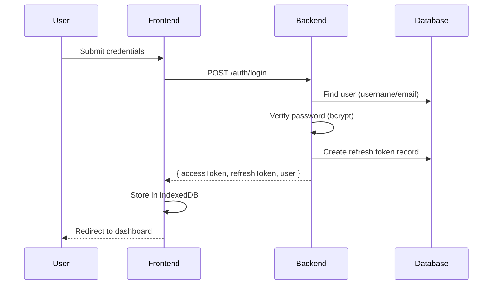
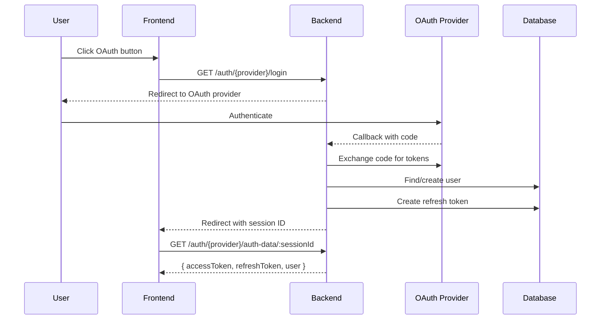
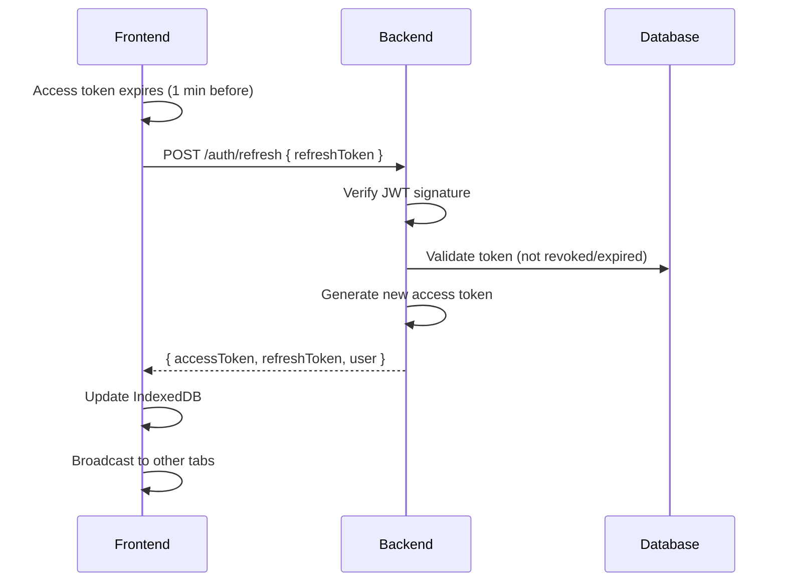
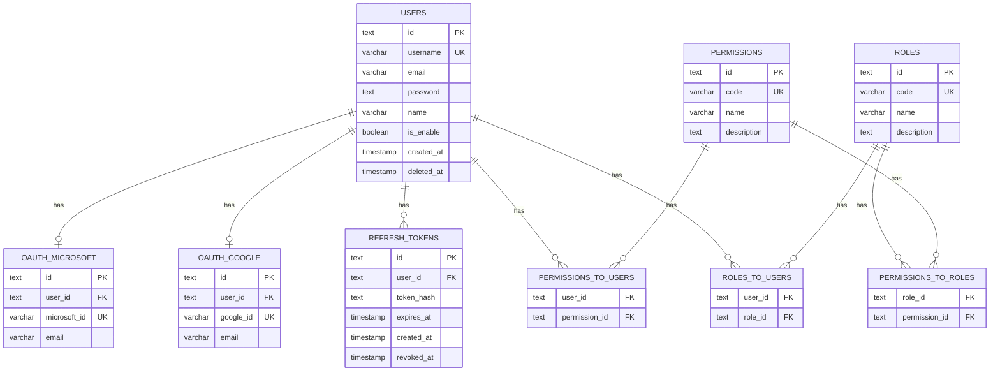

# Authentication

## Contents

1. [Overview](#overview)
2. [Flows](#flows)
3. [Database Schema](#database-schema)
4. [Important Notes](#important-notes)
5. [Revision History](#revision-history)

---

## Overview

JWT-based authentication system with RS256 asymmetric signing supporting multiple authentication methods.

**Key Features:**
- Username/password authentication with bcrypt hashing
- OAuth 2.0 integration (Google, Microsoft)
- Token-based stateless authentication with automatic refresh
- Multi-tab synchronization using BroadcastChannel API
- Role-based access control (RBAC) with granular permissions

**Token Strategy:**
- **Access Token**: 5-minute TTL, embeds `uid`, `permissions`, `roles` - stored in memory
- **Refresh Token**: 60-day TTL, hashed (bcrypt) and persisted in database - allows multi-device support

**Storage:**
- Backend: Refresh tokens hashed in PostgreSQL with revocation support
- Frontend: IndexedDB with BroadcastChannel for cross-tab synchronization

---

## Flows

### Username/Password Login

### OAuth Flow (Google/Microsoft)

### Token Refresh

**Key Behaviors:**
- Refresh starts 60 seconds before expiry
- **Multi-tab coordination**: Uses `localStorage` lock to prevent concurrent refreshes
- **Reuses refresh token** - same token valid across all devices/tabs until revoked
- Failed refresh (401) triggers automatic logout across all tabs

---

## Database Schema

---

## Important Notes

### Multi-Tab/Device Behavior

**Refresh Token Reuse Strategy:**
- Single refresh token valid across multiple tabs and devices
- No automatic rotation on refresh (original design decision for simplicity)
- Token only revoked on explicit logout or expiration
- Allows users to stay logged in on multiple devices without interruption

**Cross-Tab Synchronization:**
1. **BroadcastChannel API** (primary): Real-time sync for modern browsers
2. **localStorage events** (fallback): For older browsers or when BroadcastChannel unavailable
3. **Lock mechanism**: Prevents multiple tabs from refreshing simultaneously

**Frontend Events:**
- `logout`: Broadcasts logout to all tabs, triggers immediate session clear
- `token-refreshed`: Notifies other tabs to reload tokens from IndexedDB

### Security Considerations

**Token Signing:**
- Uses RS256 (RSA-SHA256) asymmetric encryption
- Private key auto-generated on first backend startup if missing
- Public key used for verification - safe to expose in distributed systems

**Password Handling:**
- Passwords hashed with Bun's built-in bcrypt implementation
- Original password never stored or logged
- OAuth-only users have `null` password field

**Rate Limiting:**
- Applied at endpoint level (login, refresh, OAuth)
- Configured per-route using `rateLimit()` middleware
- Limits tracked per IP address

### Edge Cases

**Disabled Users:**
- Immediately blocked from token refresh (query filters `is_enabled = true`)
- Existing access tokens remain valid until expiry (5 minutes max)
- Cannot revoke active access tokens (stateless JWT limitation)

**Deleted Users:**
- Soft-deleted users (`deleted_at IS NOT NULL`) blocked from authentication
- Refresh tokens automatically cascade-deleted via `ON DELETE CASCADE`

**Offline Behavior:**
- Frontend tolerates backend unreachability during refresh
- Keeps session active with current token
- Shows toast notification to user
- Retries refresh after 30 seconds

**OAuth Edge Cases:**
- User email mismatch between OAuth providers handled by separate `oauth_google`/`oauth_microsoft` tables
- Multiple OAuth accounts can't link to same user - creates separate users
- OAuth users without password can't use username/password login

### Performance Notes

**Middleware Efficiency:**
- `authTokenMiddleware`: Extracts JWT, sets `uid` - runs on ALL routes
- `authInfo`: Queries DB for full user data - only use on protected routes requiring role/permission checks
- `checkPermission`: Lightweight check against cached data - negligible overhead

**Database Queries:**
- User authentication loads permissions/roles via nested joins (single query)
- Refresh token validation: 2 queries (token lookup + user lookup with authorization)

### Known Limitations

1. **Access Token Revocation**: Cannot revoke active access tokens before expiry (stateless JWT trade-off)
2. **Permission Changes**: Don't take effect until next token refresh (max 5 minutes)
3. **OAuth Account Linking**: No built-in support for linking multiple OAuth accounts to one user
4. **Session Management**: No server-side session tracking - can't list/revoke individual sessions per device

---

## Revision History

| Version | Date | Summary of Change |
|---------|------|-------------------|
| 1 | 2025-12-22 | Initial documentation |
