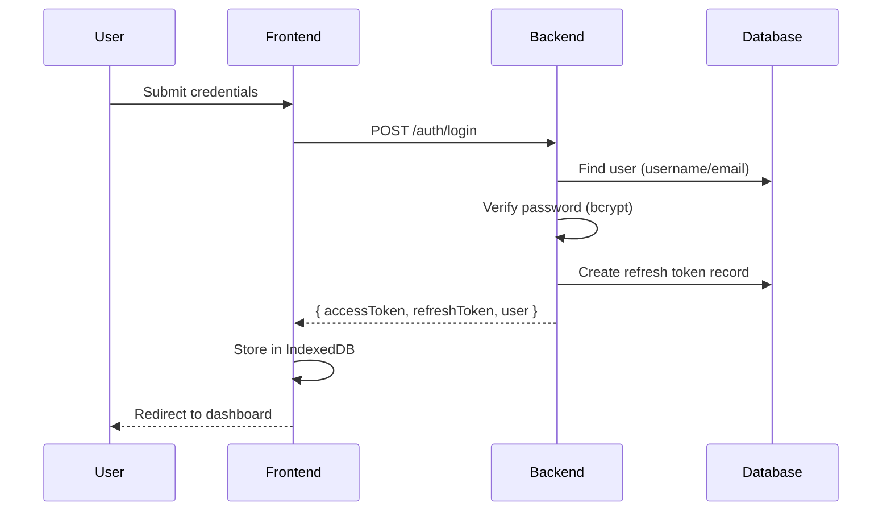
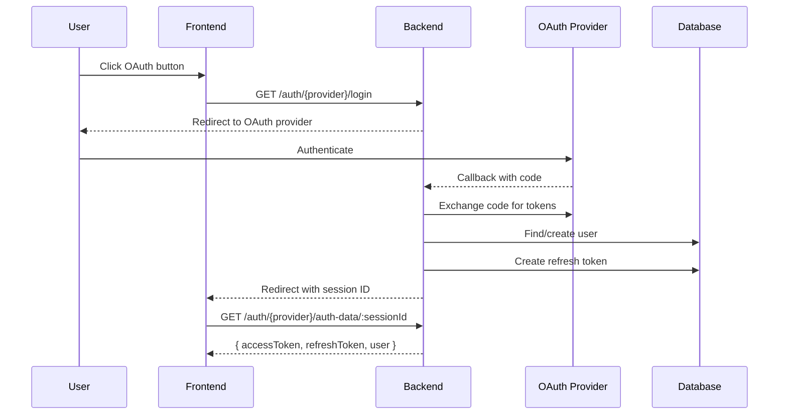
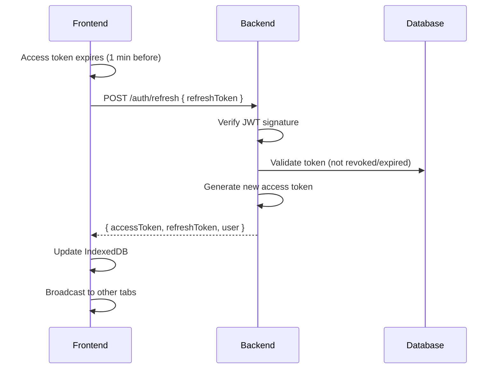

# Authentication

## Contents

1. [Overview](#overview)
2. [Auth Flows](#auth-flows)
3. [API Reference](#api-reference)
4. [Authorization](#authorization)
5. [Security](#security)
6. [Configuration](#configuration)

---

## Overview

JWT-based authentication with RS256 signing. Supports username/password login and OAuth (Google, Microsoft).

**Token Lifecycle:**
- **Access Token**: 5 minutes TTL, contains `uid`, `permissions`, `roles`
- **Refresh Token**: 60 days TTL, hashed and stored in database

**Frontend Storage:** IndexedDB with cross-tab sync via `BroadcastChannel`.

---

## Auth Flows

### Username/Password Login



### OAuth Flow (Google/Microsoft)



### Token Refresh



---

## API Reference

### Auth Endpoints

| Method | Endpoint | Permission | Description |
|--------|----------|------------|-------------|
| `GET` | `/auth/login-settings` | `guest-only` | Get enabled login methods |
| `POST` | `/auth/login` | `guest-only` | Username/password login |
| `POST` | `/auth/refresh` | `*` | Refresh access token |
| `POST` | `/auth/logout` | `authenticated-only` | Revoke refresh token |
| `GET` | `/auth/my-profile` | `authenticated-only` | Get current user profile |

### OAuth Endpoints

| Method | Endpoint | Description |
|--------|----------|-------------|
| `GET` | `/auth/google/` | Initiate Google OAuth |
| `GET` | `/auth/google/auth-data/:sessionId` | Get auth data after callback |
| `GET` | `/auth/microsoft/login` | Initiate Microsoft OAuth |
| `GET` | `/auth/microsoft/callback` | Microsoft OAuth callback |
| `GET` | `/auth/microsoft/auth-data/:sessionId` | Get auth data after callback |

### Request/Response

**Login Request:**
```json
{ "username": "string", "password": "string" }
```

**Auth Response:**
```json
{
  "accessToken": "string",
  "refreshToken": "string",
  "accessTokenExpiresIn": 300,
  "refreshTokenExpiresIn": 5184000,
  "user": {
    "id": "string",
    "name": "string",
    "permissions": ["string"],
    "roles": ["string"]
  }
}
```

---

## Authorization

### Permission Types

| Permission | Description |
|------------|-------------|
| `*` | Allow all (bypass check) |
| `authenticated-only` | Requires valid user session |
| `guest-only` | Only unauthenticated users |
| `{permission-code}` | Specific permission code |

### Middleware Chain

```
authTokenMiddleware → authInfo → checkPermission
       ↓                  ↓              ↓
  Extract JWT         Load user      Verify
  Set uid            + roles/perms   permissions
```

### Backend Usage

```typescript
// Public route (anyone)
app.get("/public", checkPermission("*"), handler);

// Authenticated users only
app.get("/dashboard", authInfo, checkPermission("authenticated-only"), handler);

// Specific permission
app.get("/users", authInfo, checkPermission("users.read"), handler);

// Multiple permissions (OR)
app.delete("/users/:id", authInfo, checkPermission("users.delete", "admin"), handler);
```

### Frontend Usage

```typescript
// Hook usage
const { user, isAuthenticated } = useAuth();
const hasAccess = usePermissions("users.read");

// Route protection - redirects to /403 if unauthorized
usePermissions(["users.read", "users.write"]);
```

---

## Security

### Token Security

| Feature | Implementation |
|---------|----------------|
| Algorithm | RS256 (RSA + SHA-256) |
| Key Storage | File-based (`private_key.pem`, `public_key.pem`) |
| Auto-generation | Keys created on first run if missing |
| Refresh Token Storage | Hashed (bcrypt) in database |
| Token Revocation | `revokedAt` timestamp in `refresh_tokens` table |

### Rate Limiting

| Endpoint | Limit | Window |
|----------|-------|--------|
| Login | 5 requests | 15 min |
| OAuth | 10 requests | 5 min |
| Token Refresh | 10 requests | 5 min |
| General API | 100 requests | 1 min |

### Password Security

- Hashing: `Bun.password.hash()` (bcrypt-based)
- Verification: Constant-time comparison

### Cross-Tab Sync

- Primary: `BroadcastChannel` API
- Fallback: `localStorage` events
- Events: `logout`, `token-refreshed`

---

## Configuration

### Backend Environment

```env
# Required
DATABASE_URL=postgresql://...
BASE_URL=http://localhost:3000
FRONTEND_URL=http://localhost:5173

# Token Keys (auto-generated if missing)
PRIVATE_KEY_PATH=private_key.pem
PUBLIC_KEY_PATH=public_key.pem
```

### OAuth Settings (via App Settings)

| Setting Key | Description |
|-------------|-------------|
| `login.usernameAndPassword.enabled` | Enable password login |
| `oauth.google.enabled` | Enable Google OAuth |
| `oauth.google.clientId` | Google Client ID |
| `oauth.google.clientSecret` | Google Client Secret |
| `oauth.microsoft.enabled` | Enable Microsoft OAuth |
| `oauth.microsoft.clientId` | Microsoft Client ID |
| `oauth.microsoft.clientSecret` | Microsoft Client Secret |

### Database Schema

```sql
-- refresh_tokens
id          TEXT PRIMARY KEY
user_id     TEXT REFERENCES users(id) ON DELETE CASCADE
token_hash  TEXT NOT NULL
expires_at  TIMESTAMP NOT NULL
created_at  TIMESTAMP DEFAULT NOW()
revoked_at  TIMESTAMP

-- users (auth-related fields)
id          TEXT PRIMARY KEY
username    VARCHAR UNIQUE NOT NULL
email       VARCHAR
password    TEXT  -- null for OAuth-only users
is_enable   BOOLEAN DEFAULT true
deleted_at  TIMESTAMP
```
