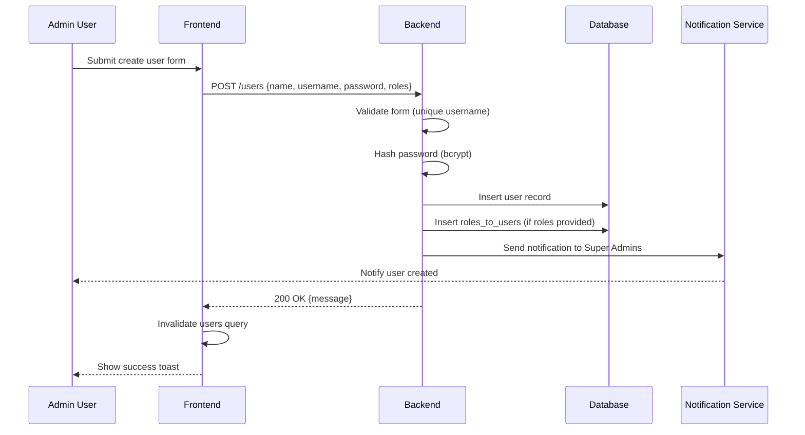
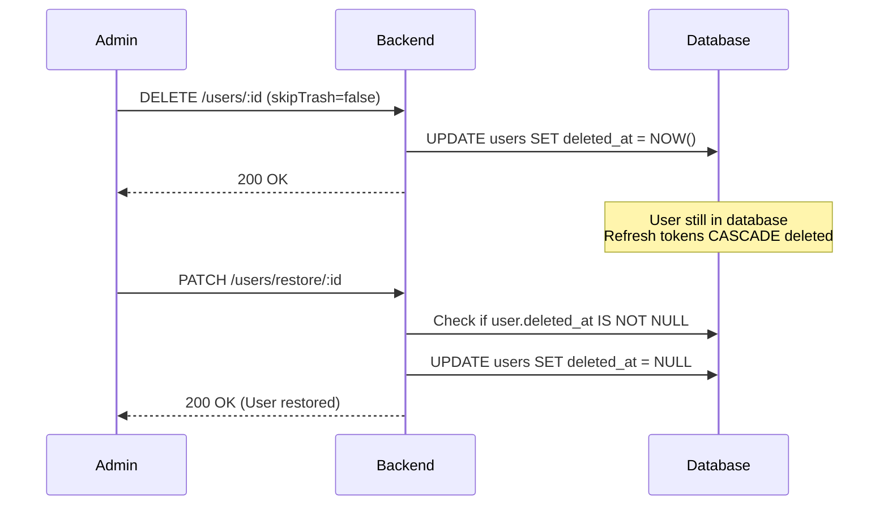
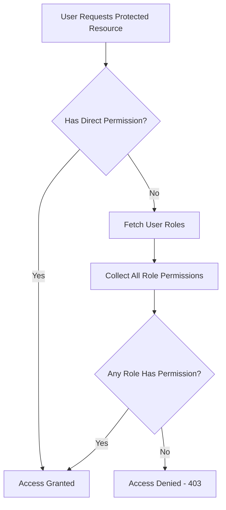
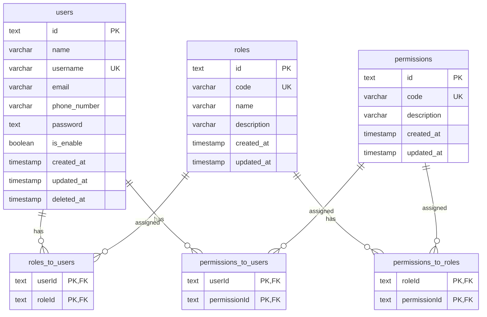
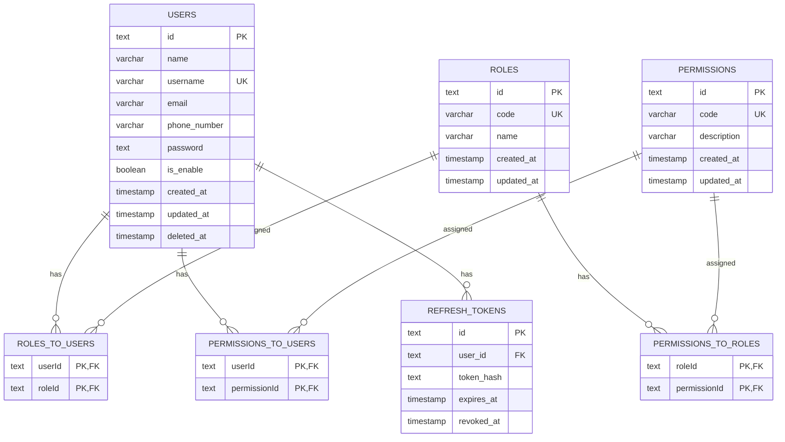

# User Management

## Contents

1. [Overview](#overview)
2. [Flows](#flows)
3. [Database Schema](#database-schema)
4. [Important Notes](#important-notes)
5. [Revision History](#revision-history)

---

## Overview

Comprehensive user, role, and permission management system with RBAC (Role-Based Access Control) supporting both direct permission assignment and role-based inheritance.

**Key Features:**
- User CRUD with soft-delete (trash/restore/permanent delete)
- Hierarchical permission system (user-direct + role-inherited)
- Protected system roles (Super Admin cannot be deleted)
- Advanced data table with server-side pagination, search, filtering, and sorting
- Real-time notifications on user creation

**Authorization Model:**
```
User Effective Permissions = Direct Permissions ∪ Role Permissions
```

---

## Flows

### User Creation Flow



### Soft Delete & Restore Flow



### Permission Resolution Flow



---

## Database Schema



## Database Schema



**Key Relationships:**
- `roles_to_users`: CASCADE on role delete, CASCADE on user delete
- `permissions_to_users`: No cascade (manual cleanup via cleanup functions)
- `refresh_tokens`: CASCADE on user delete (auto-logout on user removal)

---

## Important Notes

### Soft Delete System

**Default Behavior:**
- Users are soft-deleted by default (`DELETE /users/:id` with `skipTrash=false`)
- Soft-deleted users have `deletedAt` timestamp set
- Cascade effects on soft delete:
  - ✅ `refresh_tokens` physically deleted (CASCADE constraint)
  - ❌ `roles_to_users` remain intact (allows restoration with original roles)
  - ❌ `permissions_to_users` remain intact

**Permanent Delete:**
- Use `skipTrash=true` form parameter
- Physically removes user record
- Cascades to all related tables via database constraints

**Self-Delete Prevention:**
- Users cannot delete their own account
- Backend validates `userId !== currentUserId`
- Returns 400 error if attempted

### Super Admin Protection

**Hard-coded Protections:**
- Super Admin role (`code: "super-admin"`) cannot be deleted
- Backend query filters: `WHERE NOT (name = 'Super Admin')`
- Returns 404 if deletion attempted (role appears non-existent)
- Frontend displays "Superadmin" user with disabled delete button

**Why Protected:**
- System requires at least one Super Admin for administrative access
- Prevents lock-out scenarios where all admins are deleted

### Permission Resolution

**Computation:**
```typescript
// Backend: authInfo middleware
permissions = new Set([
  ...userDirectPermissions,
  ...roleBased Permissions (flattened from all roles)
]);
```

**Important Behaviors:**
- Permissions are **additive** (union, not intersection)
- Having role "A" + direct permission "X" = all role A permissions + permission X
- Removing a role doesn't affect direct permissions
- Permission changes take effect after next access token refresh (max 5 minutes)

**Query Efficiency:**
- Single query with nested joins loads user + roles + permissions
- Result cached in access token JWT (no DB lookup per request)

### Role Update Behavior

**Complete Replacement:**
- Updating user roles is **not additive** - it's a complete replacement
- Backend flow:
  1. DELETE all existing `roles_to_users` for user
  2. INSERT new `roles_to_users` from request
- Frontend must send full role array, not just changes

**Example:**
```typescript
// User currently has roles: ["role-1", "role-2"]
PATCH /users/:id { roles: ["role-3"] }
// Result: User now has ONLY ["role-3"]
```

### Username Uniqueness

**Constraint:**
- Database unique constraint on `users.username`
- Backend validation returns 422 with field-specific error:
```json
{
  "errorCode": "INVALID_FORM_DATA",
  "formErrors": { "username": "This username is already exists" }
}
```

**Frontend Handling:**
- React Hook Form maps `formErrors` to field-level validation
- Shows inline error message below username input
- Prevents form submission until resolved

### Notification System

**Trigger:**
- Creating a user sends notification to all users with `super-admin` role
- Uses `sendToRoles(["super-admin"], notification)` utility
- Non-blocking (notification failure doesn't fail user creation)

**Notification Content:**
```typescript
{
  title: "User Created",
  message: "User {name} has been created",
  type: "info"
}
```

### Frontend Data Table

**Features Implemented:**
- Server-side pagination (configurable per-page: 10/25/50/100)
- Multi-column sorting (client sends: `?sort=name:asc,createdAt:desc`)
- Advanced filtering with date ranges for `createdAt`
- Global search across name/username/email/ID
- Column visibility toggle
- State persistence in localStorage (`users-table` key)

**Sortable Columns:**
`name`, `username`, `email`, `isEnabled`, `createdAt`

**Filterable Columns:**
`name`, `isEnabled`, `roles` (multi-select), `createdAt` (date range)

**Performance:**
- Uses `placeholderData` to prevent loading flicker during pagination
- Query automatically refetches when params change
- Debounced search input (avoids excessive API calls)

### Password Handling

**Creation:**
- Minimum 6 characters validation
- Hashed with `Bun.password.hash()` before storage
- Never logged or sent in responses

**Update:**
- Password field optional in PATCH request
- Omitting password keeps existing hash unchanged
- Backend logic:
```typescript
...(userData.password ? { password: await hashPassword(userData.password) } : {})
```

### Edge Cases

**Restoring Non-Deleted User:**
- Returns 400: "The user is not deleted"
- Frontend should gray out/hide restore button for active users

**Deleting Non-Existent User:**
- Returns 404: "The user does not exists" (sic - typo in code)

**Empty Role Array:**
- Sending `roles: []` removes all role assignments
- User retains only direct permissions

**OAuth Users:**
- Can have `password: null` if created via OAuth only
- Cannot log in with username/password
- Still manageable through user management interface

### Testing Utilities

**Test User Creation:**
- `createUserForTesting()` utility pre-seeds permissions and roles
- Returns user object + valid access token for API testing
- Example:
```typescript
const testUser = await createUserForTesting({
  permissions: ["users.readAll", "users.create"]
});
// Use: testUser.accessToken, testUser.user.id
```

**Cleanup:**
- `cleanupTestUser(userId)` removes user + all associations
- Explicit cleanup in `afterAll()` hooks to prevent test pollution

---

## Revision History

| Version | Date | Summary of Change |
|---------|------|-------------------|
| 1 | 2025-12-22 | Initial documentation |
