# Authentication Flow Diagrams

This document contains visual flow diagrams for the authentication system using Mermaid syntax.

## User Authentication Flow

### Complete Login Process

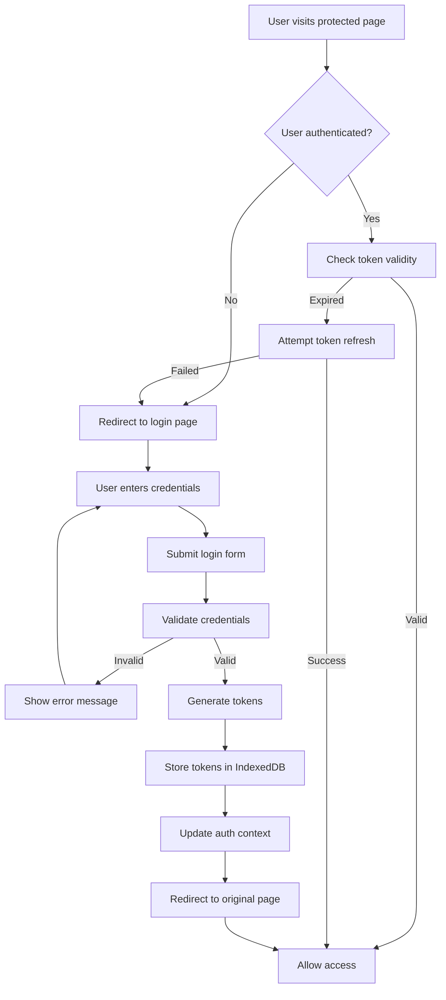
```mermaid
flowchart TD
    A[User visits protected page] --> B{User authenticated?}
    B -->|No| C[Redirect to login page]
    B -->|Yes| D[Check token validity]
    D -->|Valid| E[Allow access]
    D -->|Expired| F[Attempt token refresh]
    F -->|Success| E
    F -->|Failed| C
    
    C --> G[User enters credentials]
    G --> H[Submit login form]
    H --> I[Validate credentials]
    I -->|Invalid| J[Show error message]
    J --> G
    I -->|Valid| K[Generate tokens]
    K --> L[Store tokens in IndexedDB]
    L --> M[Update auth context]
    M --> N[Redirect to original page]
    N --> E
```

### Registration Flow

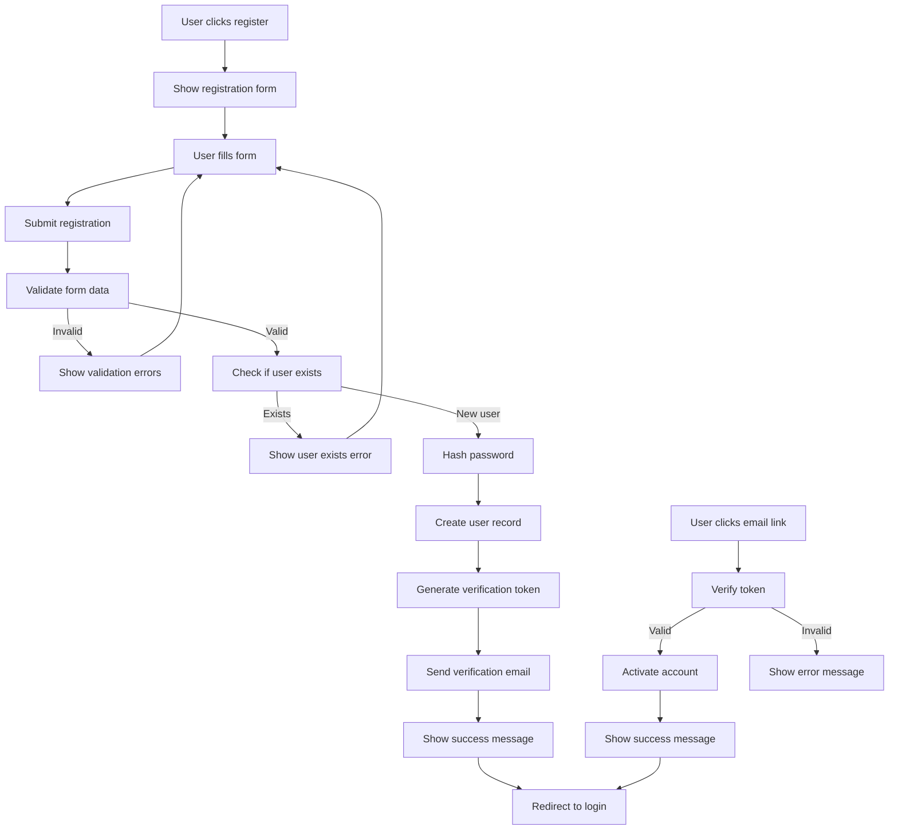
```mermaid
flowchart TD
    A[User clicks register] --> B[Show registration form]
    B --> C[User fills form]
    C --> D[Submit registration]
    D --> E[Validate form data]
    E -->|Invalid| F[Show validation errors]
    F --> C
    E -->|Valid| G[Check if user exists]
    G -->|Exists| H[Show user exists error]
    H --> C
    G -->|New user| I[Hash password]
    I --> J[Create user record]
    J --> K[Generate verification token]
    K --> L[Send verification email]
    L --> M[Show success message]
    M --> N[Redirect to login]
    
    O[User clicks email link] --> P[Verify token]
    P -->|Valid| Q[Activate account]
    P -->|Invalid| R[Show error message]
    Q --> S[Show success message]
    S --> N
```

### Password Reset Flow

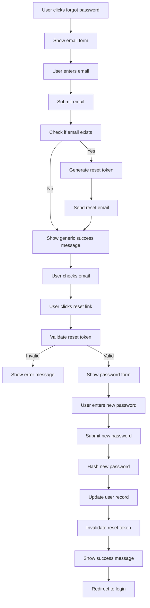
```mermaid
flowchart TD
    A[User clicks forgot password] --> B[Show email form]
    B --> C[User enters email]
    C --> D[Submit email]
    D --> E[Check if email exists]
    E -->|No| F[Show generic success message]
    E -->|Yes| G[Generate reset token]
    G --> H[Send reset email]
    H --> F
    F --> I[User checks email]
    
    I --> J[User clicks reset link]
    J --> K[Validate reset token]
    K -->|Invalid| L[Show error message]
    K -->|Valid| M[Show password form]
    M --> N[User enters new password]
    N --> O[Submit new password]
    O --> P[Hash new password]
    P --> Q[Update user record]
    Q --> R[Invalidate reset token]
    R --> S[Show success message]
    S --> T[Redirect to login]
```

## Token Management Flow

### Token Refresh Process

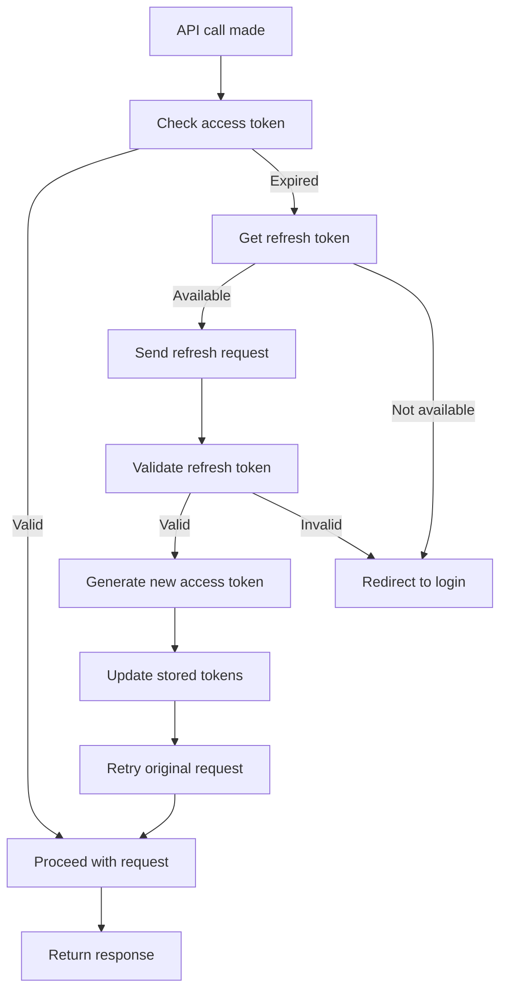
```mermaid
flowchart TD
    A[API call made] --> B[Check access token]
    B -->|Valid| C[Proceed with request]
    B -->|Expired| D[Get refresh token]
    D -->|Available| E[Send refresh request]
    D -->|Not available| F[Redirect to login]
    
    E --> G[Validate refresh token]
    G -->|Valid| H[Generate new access token]
    G -->|Invalid| F
    H --> I[Update stored tokens]
    I --> J[Retry original request]
    J --> C
    
    C --> K[Return response]
```

### Logout Flow

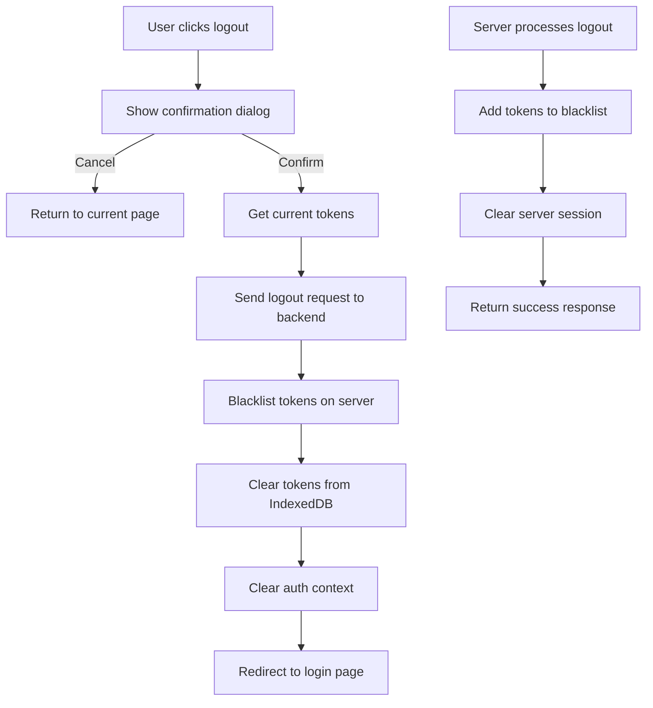
```mermaid
flowchart TD
    A[User clicks logout] --> B[Show confirmation dialog]
    B -->|Cancel| C[Return to current page]
    B -->|Confirm| D[Get current tokens]
    D --> E[Send logout request to backend]
    E --> F[Blacklist tokens on server]
    F --> G[Clear tokens from IndexedDB]
    G --> H[Clear auth context]
    H --> I[Redirect to login page]
    
    J[Server processes logout] --> K[Add tokens to blacklist]
    K --> L[Clear server session]
    L --> M[Return success response]
```

## Permission-Based Access Control

### Route Protection Flow

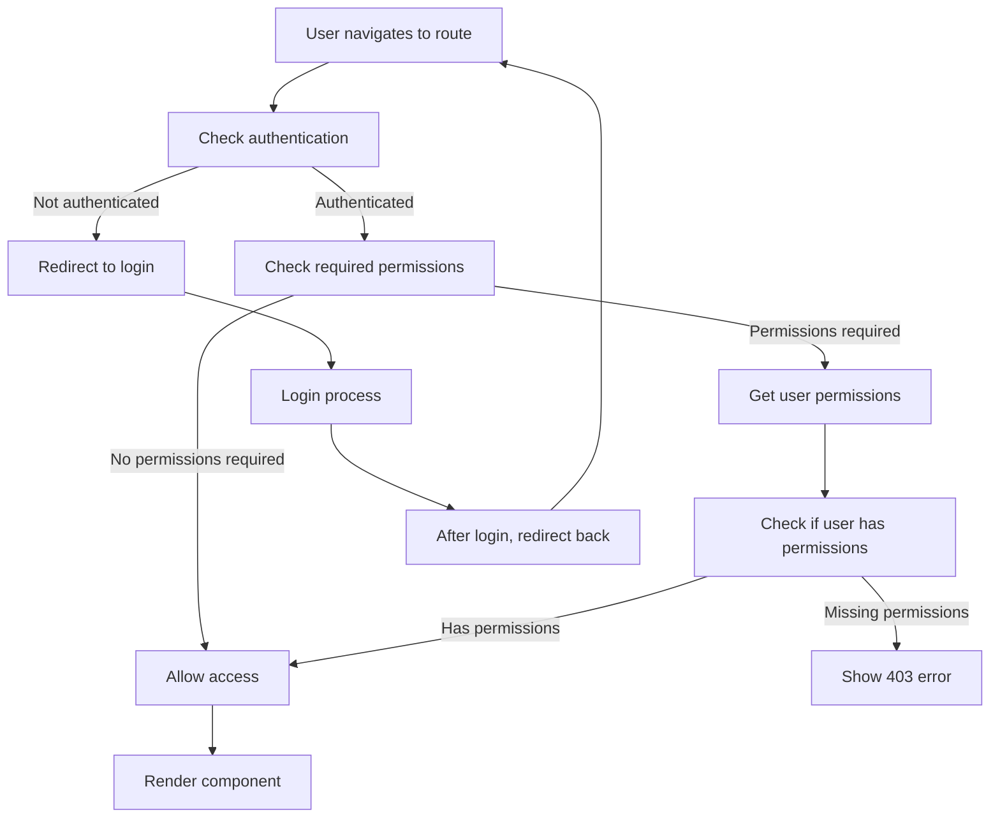
```mermaid
flowchart TD
    A[User navigates to route] --> B[Check authentication]
    B -->|Not authenticated| C[Redirect to login]
    B -->|Authenticated| D[Check required permissions]
    D -->|No permissions required| E[Allow access]
    D -->|Permissions required| F[Get user permissions]
    F --> G[Check if user has permissions]
    G -->|Has permissions| E
    G -->|Missing permissions| H[Show 403 error]
    
    E --> I[Render component]
    
    C --> J[Login process]
    J --> K[After login, redirect back]
    K --> A
```

### Component-Level Permission Flow

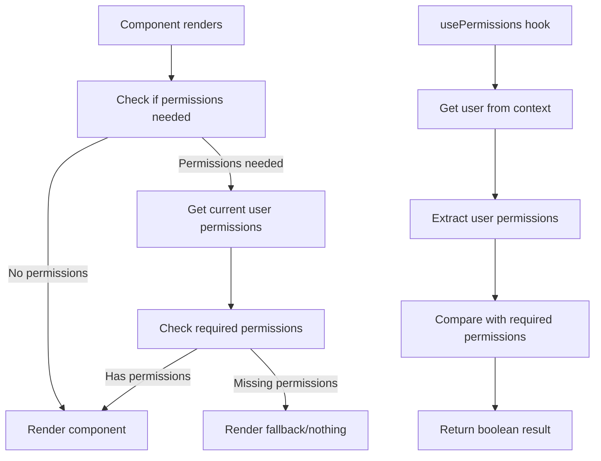
```mermaid
flowchart TD
    A[Component renders] --> B[Check if permissions needed]
    B -->|No permissions| C[Render component]
    B -->|Permissions needed| D[Get current user permissions]
    D --> E[Check required permissions]
    E -->|Has permissions| C
    E -->|Missing permissions| F[Render fallback/nothing]
    
    G[usePermissions hook] --> H[Get user from context]
    H --> I[Extract user permissions]
    I --> J[Compare with required permissions]
    J --> K[Return boolean result]
```

## OAuth Integration Flow

### Google OAuth Flow

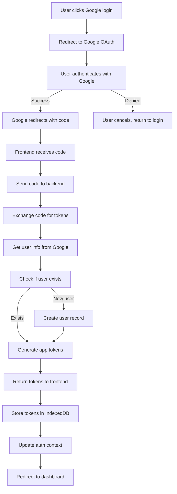
```mermaid
flowchart TD
    A[User clicks Google login] --> B[Redirect to Google OAuth]
    B --> C[User authenticates with Google]
    C -->|Success| D[Google redirects with code]
    C -->|Denied| E[User cancels, return to login]
    
    D --> F[Frontend receives code]
    F --> G[Send code to backend]
    G --> H[Exchange code for tokens]
    H --> I[Get user info from Google]
    I --> J[Check if user exists]
    J -->|Exists| K[Generate app tokens]
    J -->|New user| L[Create user record]
    L --> K
    
    K --> M[Return tokens to frontend]
    M --> N[Store tokens in IndexedDB]
    N --> O[Update auth context]
    O --> P[Redirect to dashboard]
```

### GitHub OAuth Flow

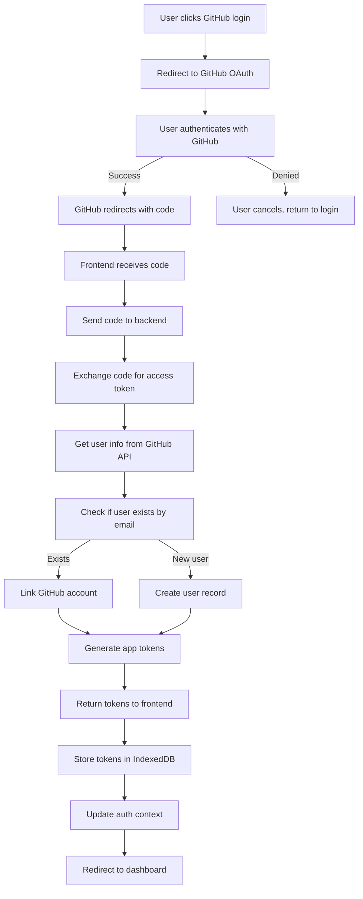
```mermaid
flowchart TD
    A[User clicks GitHub login] --> B[Redirect to GitHub OAuth]
    B --> C[User authenticates with GitHub]
    C -->|Success| D[GitHub redirects with code]
    C -->|Denied| E[User cancels, return to login]
    
    D --> F[Frontend receives code]
    F --> G[Send code to backend]
    G --> H[Exchange code for access token]
    H --> I[Get user info from GitHub API]
    I --> J[Check if user exists by email]
    J -->|Exists| K[Link GitHub account]
    J -->|New user| L[Create user record]
    
    K --> M[Generate app tokens]
    L --> M
    M --> N[Return tokens to frontend]
    N --> O[Store tokens in IndexedDB]
    O --> P[Update auth context]
    P --> Q[Redirect to dashboard]
```

## Error Handling Flows

### Authentication Error Flow

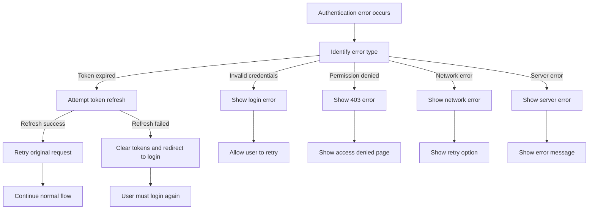
```mermaid
flowchart TD
    A[Authentication error occurs] --> B[Identify error type]
    B -->|Invalid credentials| C[Show login error]
    B -->|Token expired| D[Attempt token refresh]
    B -->|Permission denied| E[Show 403 error]
    B -->|Network error| F[Show network error]
    B -->|Server error| G[Show server error]
    
    D -->|Refresh success| H[Retry original request]
    D -->|Refresh failed| I[Clear tokens and redirect to login]
    
    C --> J[Allow user to retry]
    E --> K[Show access denied page]
    F --> L[Show retry option]
    G --> M[Show error message]
    
    H --> N[Continue normal flow]
    I --> O[User must login again]
```

### Rate Limiting Flow

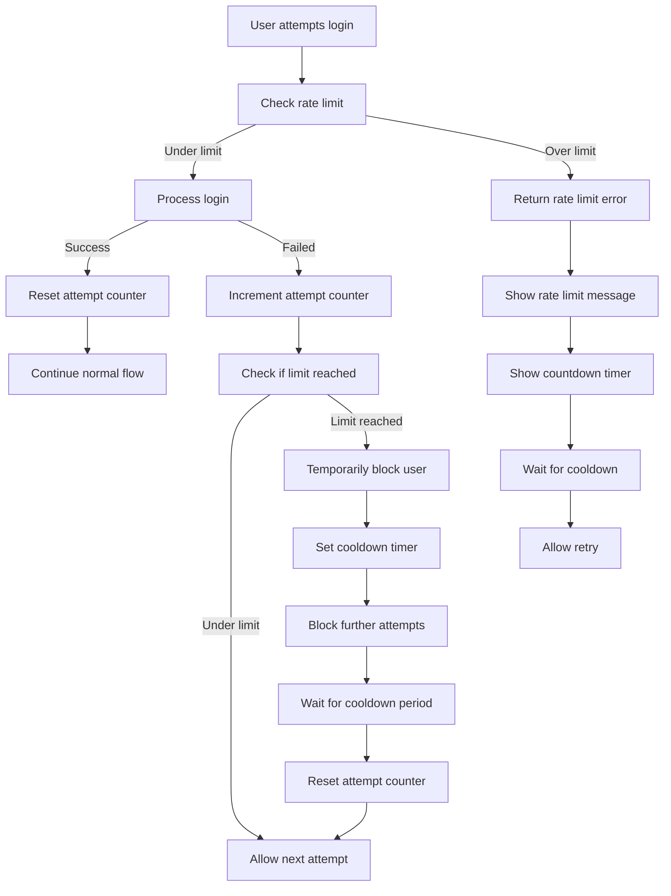
```mermaid
flowchart TD
    A[User attempts login] --> B[Check rate limit]
    B -->|Under limit| C[Process login]
    B -->|Over limit| D[Return rate limit error]
    
    C -->|Success| E[Reset attempt counter]
    C -->|Failed| F[Increment attempt counter]
    
    E --> G[Continue normal flow]
    F --> H[Check if limit reached]
    H -->|Under limit| I[Allow next attempt]
    H -->|Limit reached| J[Temporarily block user]
    
    D --> K[Show rate limit message]
    K --> L[Show countdown timer]
    L --> M[Wait for cooldown]
    M --> N[Allow retry]
    
    J --> O[Set cooldown timer]
    O --> P[Block further attempts]
    P --> Q[Wait for cooldown period]
    Q --> R[Reset attempt counter]
    R --> I
```

## Session Management Flow

### Session Creation and Validation

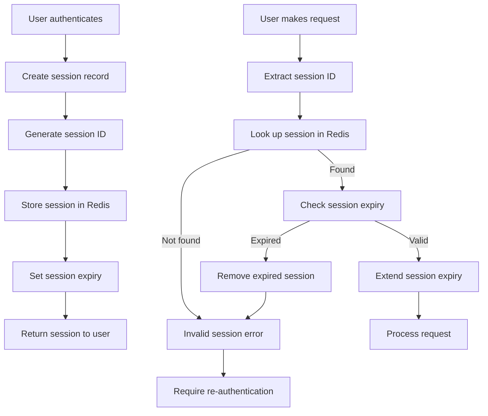
```mermaid
flowchart TD
    A[User authenticates] --> B[Create session record]
    B --> C[Generate session ID]
    C --> D[Store session in Redis]
    D --> E[Set session expiry]
    E --> F[Return session to user]
    
    G[User makes request] --> H[Extract session ID]
    H --> I[Look up session in Redis]
    I -->|Found| J[Check session expiry]
    I -->|Not found| K[Invalid session error]
    
    J -->|Valid| L[Extend session expiry]
    J -->|Expired| M[Remove expired session]
    M --> K
    
    L --> N[Process request]
    K --> O[Require re-authentication]
```

### Multi-Device Session Management

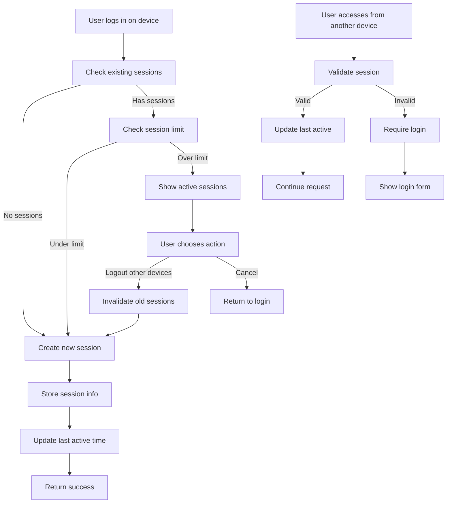
```mermaid
flowchart TD
    A[User logs in on device] --> B[Check existing sessions]
    B -->|No sessions| C[Create new session]
    B -->|Has sessions| D[Check session limit]
    
    D -->|Under limit| C
    D -->|Over limit| E[Show active sessions]
    E --> F[User chooses action]
    F -->|Logout other devices| G[Invalidate old sessions]
    F -->|Cancel| H[Return to login]
    
    G --> C
    C --> I[Store session info]
    I --> J[Update last active time]
    J --> K[Return success]
    
    L[User accesses from another device] --> M[Validate session]
    M -->|Valid| N[Update last active]
    M -->|Invalid| O[Require login]
    
    N --> P[Continue request]
    O --> Q[Show login form]
```

## Security Flow Diagrams

### Brute Force Protection

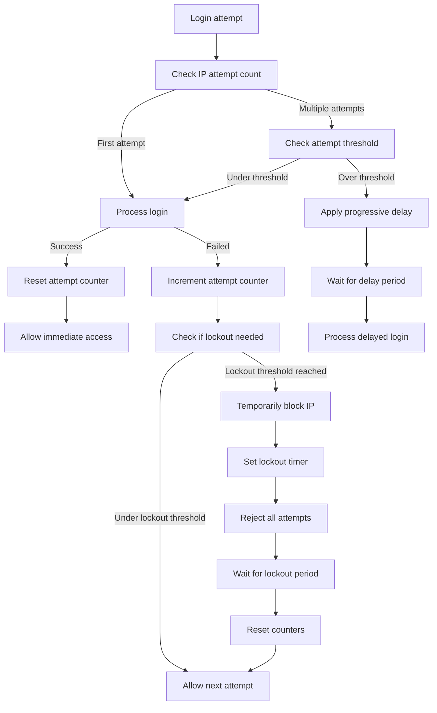
```mermaid
flowchart TD
    A[Login attempt] --> B[Check IP attempt count]
    B -->|First attempt| C[Process login]
    B -->|Multiple attempts| D[Check attempt threshold]
    
    D -->|Under threshold| C
    D -->|Over threshold| E[Apply progressive delay]
    
    C -->|Success| F[Reset attempt counter]
    C -->|Failed| G[Increment attempt counter]
    
    E --> H[Wait for delay period]
    H --> I[Process delayed login]
    
    F --> J[Allow immediate access]
    G --> K[Check if lockout needed]
    
    K -->|Under lockout threshold| L[Allow next attempt]
    K -->|Lockout threshold reached| M[Temporarily block IP]
    
    M --> N[Set lockout timer]
    N --> O[Reject all attempts]
    O --> P[Wait for lockout period]
    P --> Q[Reset counters]
    Q --> L
```

### Token Security Flow

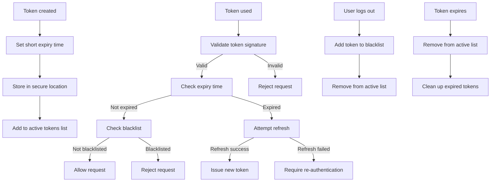
```mermaid
flowchart TD
    A[Token created] --> B[Set short expiry time]
    B --> C[Store in secure location]
    C --> D[Add to active tokens list]
    
    E[Token used] --> F[Validate token signature]
    F -->|Valid| G[Check expiry time]
    F -->|Invalid| H[Reject request]
    
    G -->|Not expired| I[Check blacklist]
    G -->|Expired| J[Attempt refresh]
    
    I -->|Not blacklisted| K[Allow request]
    I -->|Blacklisted| L[Reject request]
    
    J -->|Refresh success| M[Issue new token]
    J -->|Refresh failed| N[Require re-authentication]
    
    O[User logs out] --> P[Add token to blacklist]
    P --> Q[Remove from active list]
    
    R[Token expires] --> S[Remove from active list]
    S --> T[Clean up expired tokens]
```

## Data Flow Diagrams

### User Data Synchronization

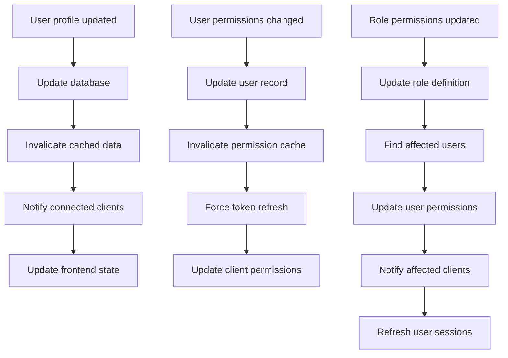
```mermaid
flowchart TD
    A[User profile updated] --> B[Update database]
    B --> C[Invalidate cached data]
    C --> D[Notify connected clients]
    D --> E[Update frontend state]
    
    F[User permissions changed] --> G[Update user record]
    G --> H[Invalidate permission cache]
    H --> I[Force token refresh]
    I --> J[Update client permissions]
    
    K[Role permissions updated] --> L[Update role definition]
    L --> M[Find affected users]
    M --> N[Update user permissions]
    N --> O[Notify affected clients]
    O --> P[Refresh user sessions]
```

### Authentication State Management

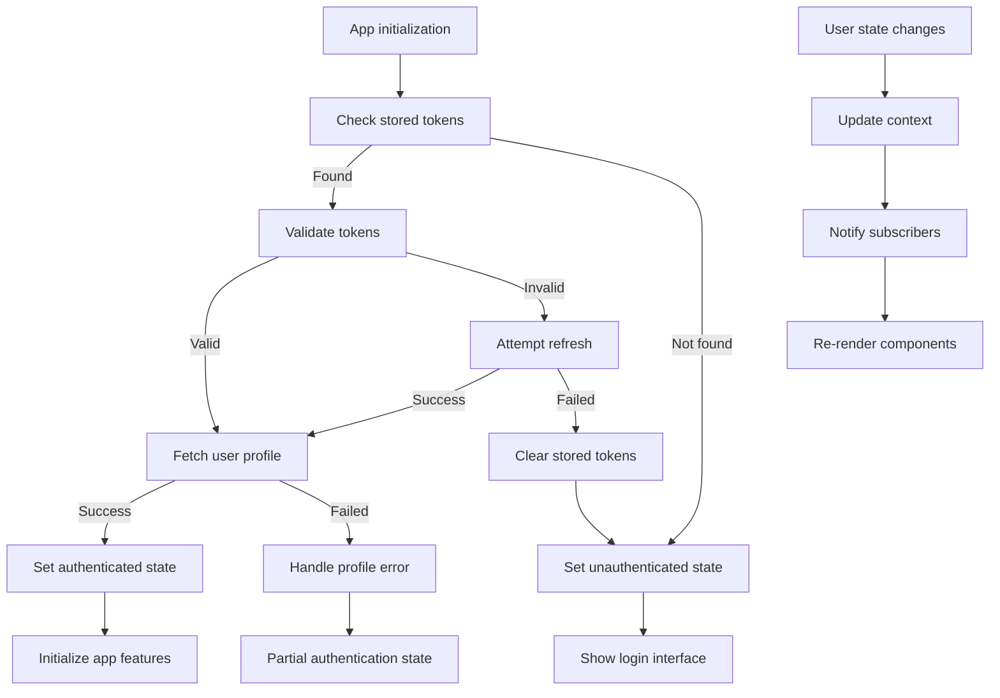
```mermaid
flowchart TD
    A[App initialization] --> B[Check stored tokens]
    B -->|Found| C[Validate tokens]
    B -->|Not found| D[Set unauthenticated state]
    
    C -->|Valid| E[Fetch user profile]
    C -->|Invalid| F[Attempt refresh]
    
    F -->|Success| E
    F -->|Failed| G[Clear stored tokens]
    G --> D
    
    E -->|Success| H[Set authenticated state]
    E -->|Failed| I[Handle profile error]
    
    H --> J[Initialize app features]
    I --> K[Partial authentication state]
    D --> L[Show login interface]
    
    M[User state changes] --> N[Update context]
    N --> O[Notify subscribers]
    O --> P[Re-render components]
```

## Integration Flow Diagrams

### Backend-Frontend Authentication Integration

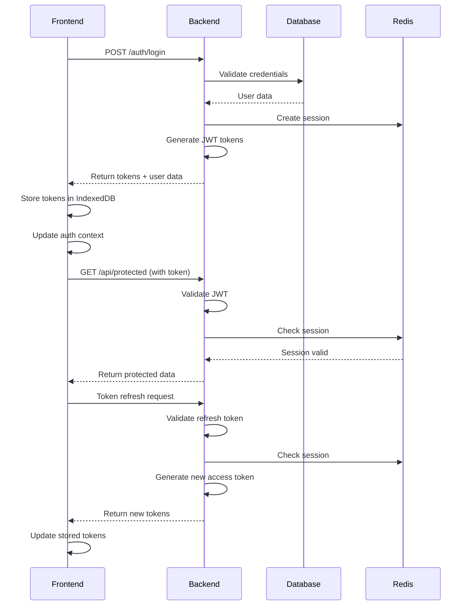
```mermaid
sequenceDiagram
    participant F as Frontend
    participant B as Backend
    participant DB as Database
    participant R as Redis
    
    F->>B: POST /auth/login
    B->>DB: Validate credentials
    DB-->>B: User data
    B->>R: Create session
    B->>B: Generate JWT tokens
    B-->>F: Return tokens + user data
    F->>F: Store tokens in IndexedDB
    F->>F: Update auth context
    
    F->>B: GET /api/protected (with token)
    B->>B: Validate JWT
    B->>R: Check session
    R-->>B: Session valid
    B-->>F: Return protected data
    
    F->>B: Token refresh request
    B->>B: Validate refresh token
    B->>R: Check session
    B->>B: Generate new access token
    B-->>F: Return new tokens
    F->>F: Update stored tokens
```

### OAuth Provider Integration

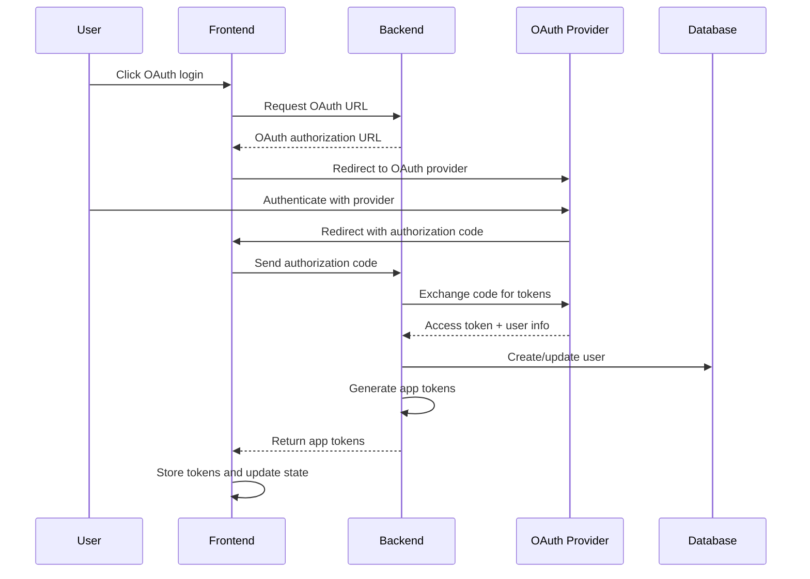
```mermaid
sequenceDiagram
    participant U as User
    participant F as Frontend
    participant B as Backend
    participant O as OAuth Provider
    participant DB as Database
    
    U->>F: Click OAuth login
    F->>B: Request OAuth URL
    B-->>F: OAuth authorization URL
    F->>O: Redirect to OAuth provider
    U->>O: Authenticate with provider
    O->>F: Redirect with authorization code
    F->>B: Send authorization code
    B->>O: Exchange code for tokens
    O-->>B: Access token + user info
    B->>DB: Create/update user
    B->>B: Generate app tokens
    B-->>F: Return app tokens
    F->>F: Store tokens and update state
```

This comprehensive authentication flow documentation provides visual representations of all the major authentication processes in the system, making it easier to understand the complex interactions between different components and identify potential issues or improvement opportunities.
