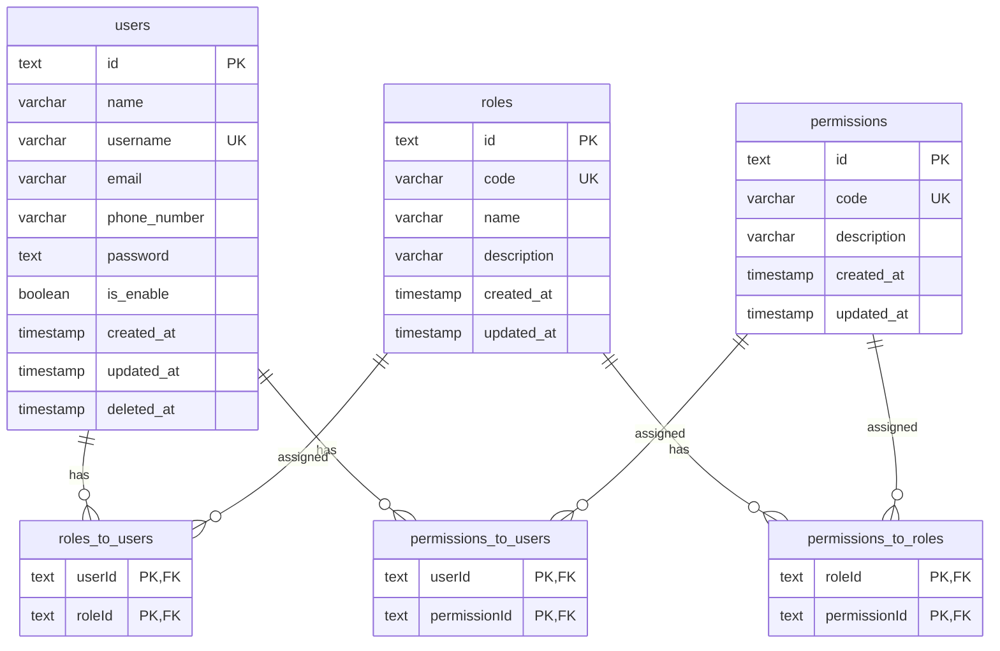

# User Management

## Contents

1. [Overview](#overview)
2. [Data Model](#data-model)
3. [API Reference](#api-reference)
4. [Permissions](#permissions)
5. [Validation](#validation)

---

## Overview

CRUD operations for users, roles, and permissions with soft-delete support.

**Key Features:**
- User CRUD with soft-delete (trash/restore)
- Role-based access control (RBAC)
- Direct user-permission assignment
- Paginated listings with search, filter, and sort

---

## Data Model



**Authorization Resolution:**
User permissions = Direct permissions + All permissions from assigned roles

---

## API Reference

### Users `/users`

| Method | Endpoint | Permission | Description |
|--------|----------|------------|-------------|
| `GET` | `/users` | `users.readAll` | List users (paginated) |
| `GET` | `/users/:id` | `users.readAll` | Get user by ID |
| `POST` | `/users` | `users.create` | Create user |
| `PATCH` | `/users/:id` | `users.update` | Update user |
| `DELETE` | `/users/:id` | `users.delete` | Soft-delete user |
| `PATCH` | `/users/restore/:id` | `users.restore` | Restore deleted user |

#### Query Parameters (GET `/users`)

| Param | Type | Description |
|-------|------|-------------|
| `page` | number | Page number (default: 1) |
| `limit` | number | Items per page |
| `q` | string | Search by name, username, email, or ID |
| `includeTrashed` | boolean | Include soft-deleted users |
| `sort` | array | Sort config `[{id, desc}]` |
| `filter` | array | Filter config `[{id, value}]` |

**Filterable Fields:** `name`, `isEnabled`, `roles`, `createdAt` (date range)

**Sortable Fields:** `name`, `username`, `email`, `isEnabled`, `createdAt`

#### Request Bodies

**Create User (POST):**
```json
{
  "name": "string",
  "username": "string",
  "email": "string?",
  "password": "string (min 6)",
  "isEnabled": true,
  "roles": ["roleId1", "roleId2"]
}
```

**Update User (PATCH):**
```json
{
  "name": "string?",
  "username": "string?",
  "email": "string?",
  "password": "string? (omit to keep)",
  "isEnabled": true,
  "roles": ["roleId1"]
}
```

**Delete User (DELETE):**
```
Form: skipTrash=true  // permanent delete
```

#### Response Format

**List Response:**
```json
{
  "data": [
    {
      "id": "string",
      "name": "string",
      "email": "string",
      "username": "string",
      "isEnabled": true,
      "createdAt": "timestamp",
      "updatedAt": "timestamp",
      "roles": [{ "id": "string", "name": "string", "code": "string" }]
    }
  ],
  "_metadata": {
    "currentPage": 1,
    "totalPages": 10,
    "totalItems": 100,
    "perPage": 10
  }
}
```

---

### Roles `/roles`

| Method | Endpoint | Permission | Description |
|--------|----------|------------|-------------|
| `GET` | `/roles` | `roles.read` | List roles (paginated) |
| `GET` | `/roles/:id` | `roles.read` | Get role by ID |
| `POST` | `/roles` | `roles.create` | Create role |
| `PATCH` | `/roles/:id` | `roles.update` | Update role |
| `DELETE` | `/roles/:id` | `roles.delete` | Delete role |

> **Note:** Super Admin role is protected and excluded from all operations.

#### Request Bodies

**Create/Update Role:**
```json
{
  "name": "string",
  "code": "string?",
  "description": "string",
  "permissions": ["users.readAll", "users.create"]
}
```

---

### Permissions `/permissions`

| Method | Endpoint | Permission | Description |
|--------|----------|------------|-------------|
| `GET` | `/permissions` | - | List all permissions |

**Response:**
```json
[
  { "id": "string", "code": "users.readAll" },
  { "id": "string", "code": "users.create" }
]
```

---

## Permissions

### Available Permission Codes

| Code | Description |
|------|-------------|
| `users.readAll` | View all users |
| `users.create` | Create users |
| `users.update` | Update users |
| `users.delete` | Delete users |
| `users.restore` | Restore deleted users |
| `roles.read` | View roles |
| `roles.create` | Create roles |
| `roles.update` | Update roles |
| `roles.delete` | Delete roles |
| `permissions.read` | View permissions |
| `app-settings.read` | View app settings |
| `app-settings.edit` | Edit app settings |
| `dev-routes` | Access dev routes |
| `ms-graph.read` | Microsoft Graph API access |
| `observability.read` | View observability data |
| `observability.write` | Write observability data |
| `observability.delete` | Delete observability data |

### Special Permissions

| Code | Description |
|------|-------------|
| `*` | Bypass all permission checks |
| `authenticated-only` | Any authenticated user |
| `guest-only` | Unauthenticated users only |

---

## Validation

### User Schema

```typescript
// Create
{
  name: string,         // 1-255 chars
  username: string,     // 1-255 chars, unique
  email?: string,       // valid email or empty
  password: string,     // min 6 chars
  isEnabled?: boolean,  // default: true
  roles?: string[]      // role IDs
}

// Update (all optional except validation rules apply)
{
  password?: string     // omit to keep existing
}
```

### Role Schema

```typescript
{
  name: string,         // 1-255 chars
  code?: string,        // 1-255 chars, defaults to name
  description: string,
  permissions?: PermissionCode[]
}
```

### Validation Errors

```json
{
  "errorCode": "INVALID_FORM_DATA",
  "message": "Username is already exists",
  "formErrors": {
    "username": "This username is already exists"
  },
  "statusCode": 422
}
```

---

## Notes

- **Soft Delete:** Users are soft-deleted by default (`deletedAt` timestamp). Use `skipTrash=true` for permanent deletion.
- **Password Hashing:** Passwords are hashed using `Bun.password.hash()` before storage.
- **Super Admin:** The "Super Admin" role cannot be modified or deleted.
- **Cascade Delete:** Deleting a user cascades to `roles_to_users`, `permissions_to_users`, and `refresh_tokens`.
- **Notifications:** Creating a user sends a notification to users with `super-admin` role.
